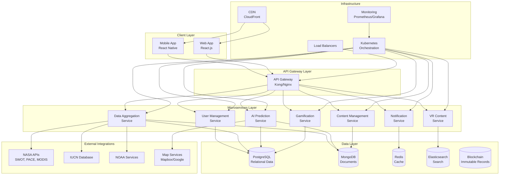
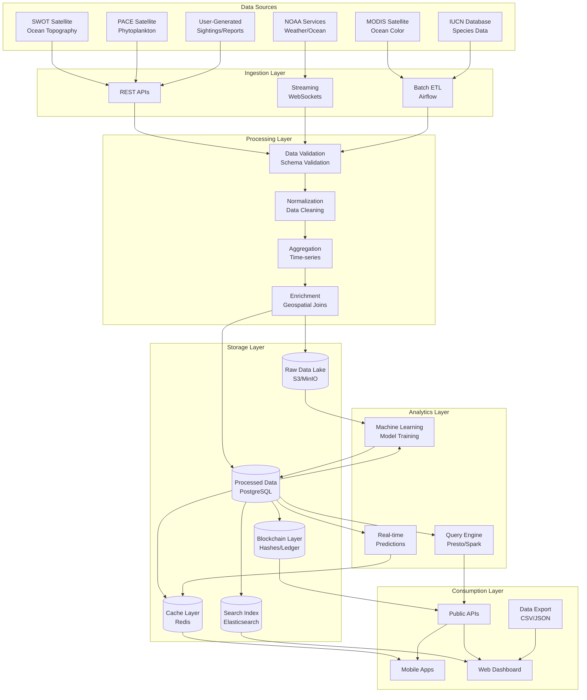
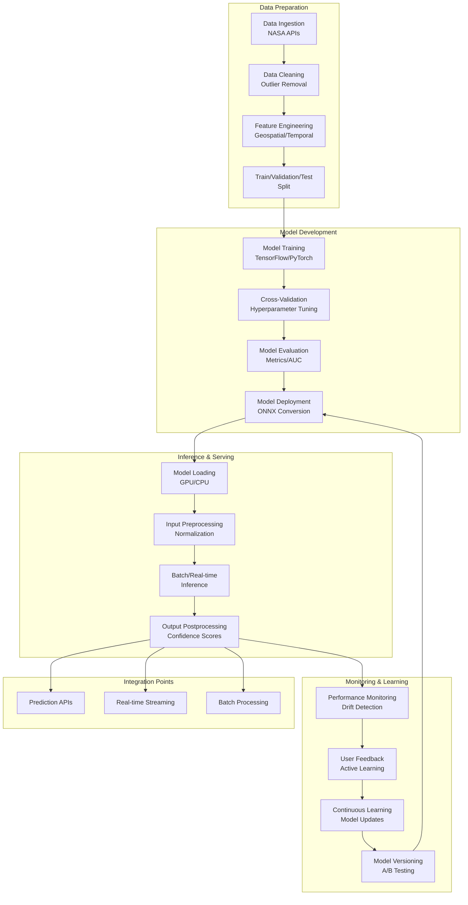
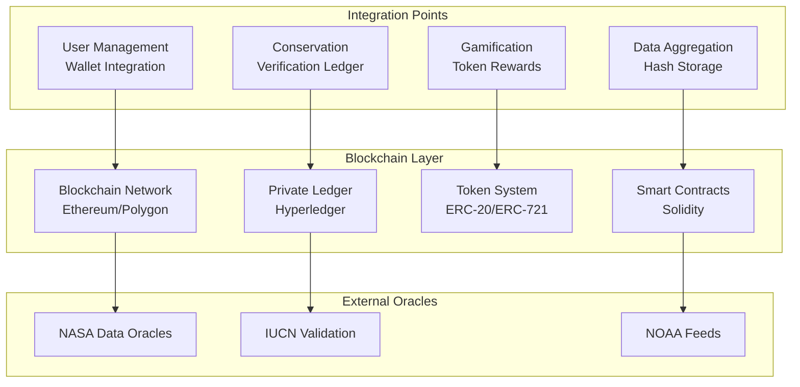
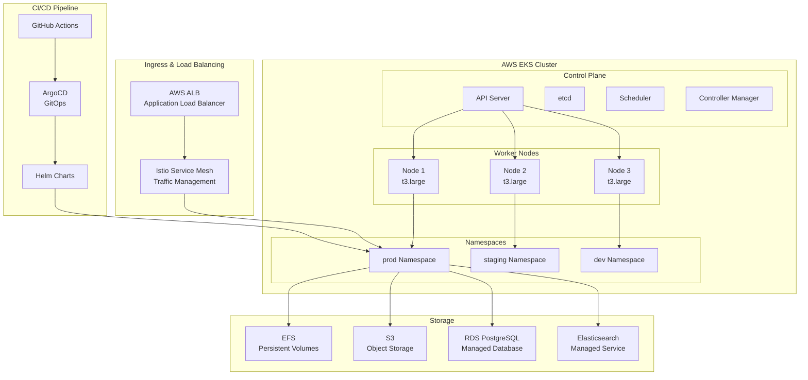
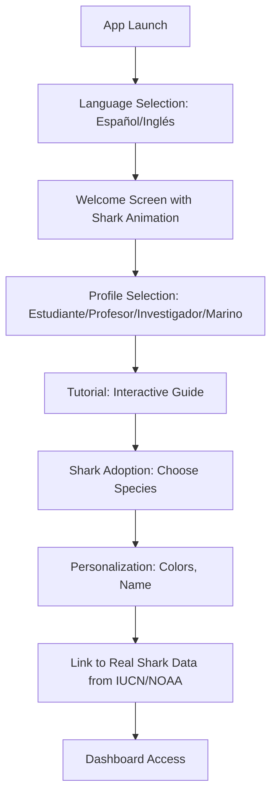
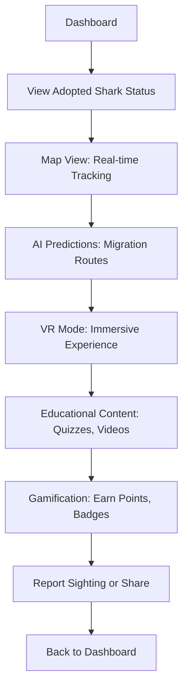

# Sharker: Detailed Design and Roadmap

## Executive Summary
This document outlines a comprehensive design for Sharker, an innovative mobile application focused on shark documentation, education, and conservation. Sharker integrates NASA Space Apps Challenge concepts with broader conservation goals, targeting students (12-16), teachers, researchers, and marine merchants. It features gamified learning, real-time tracking with geolocation for shark sightings, VR experiences, and data-driven insights from scientific sources. Users are called "Sharkers."

## Project Context
Built upon the NASA Space Apps Challenge "Sharks from Space," which uses satellite data (SWOT, PACE, MODIS) for shark tracking and habitat prediction. The app expands this to a mobile platform for education and conservation, incorporating AI predictions, VR, and gamification. Users can geolocate and report shark sightings based on their location.

## Target Audience and Personas
- **Student (12-16)**: Emma, 14-year-old gamer interested in marine life. Goals: Interactive learning, rewards.
- **Teacher**: Mr. Rivera, biology educator. Goals: Engaging lesson tools.
- **Researcher**: Dr. Patel, oceanographer. Goals: Data analysis, collaboration.
- **Marine Merchant**: Captain Lopez, navigator. Goals: Safe operations, environmental awareness.

## App Architecture

### High-Level System Architecture
The Sharker platform follows a modern microservices architecture deployed on cloud infrastructure, integrating mobile applications with AI-powered backend services and real-time data processing pipelines.

### Technology Stack Details
- **Frontend**: React Native (iOS/Android), React.js (Web)
- **Backend**: Python FastAPI microservices, Node.js for real-time services
- **Database**: PostgreSQL (structured data), MongoDB (flexible schemas), Redis (caching/session), Elasticsearch (search/VR content), Blockchain (Ethereum/Polygon for public, Hyperledger for private)
- **Cloud**: AWS EKS with Kubernetes orchestration
- **AI/ML**: TensorFlow/PyTorch for model training, ONNX for inference optimization
- **VR**: Unreal Engine 5 with WebXR for browser-based VR experiences
- **APIs**: RESTful APIs with GraphQL for complex queries, OpenAPI 3.0 specification
- **Infrastructure**: Docker containers, Kubernetes, Istio service mesh, Terraform for IaC
- **Monitoring**: Prometheus, Grafana, ELK stack for logging
- **CI/CD**: GitHub Actions, ArgoCD for GitOps
- **Features**: i18n (Spanish/English/French), a11y (WCAG 2.1 AA), offline-first architecture

### Microservices Architecture

#### Service Decomposition
The platform is decomposed into domain-driven microservices, each responsible for a specific business capability:

1. **User Management Service**
   - **Responsibilities**: Authentication, authorization, user profiles, preferences
   - **Tech**: Python FastAPI, JWT tokens, OAuth2
   - **Database**: PostgreSQL (users, sessions, permissions)
   - **APIs**: `/auth/login`, `/users/{id}`, `/profiles/adoption`

2. **Data Aggregation Service**
   - **Responsibilities**: ETL pipelines for NASA/NOAA/IUCN data, data normalization, caching
   - **Tech**: Python with Apache Airflow for scheduling, Pandas for processing
   - **Database**: PostgreSQL (normalized data), MongoDB (raw/external data)
   - **APIs**: `/data/sharks`, `/data/migrations`, `/etl/status`

3. **AI Prediction Service**
   - **Responsibilities**: ML model training, real-time predictions, migration forecasting
   - **Tech**: TensorFlow/PyTorch, scikit-learn, ONNX runtime
   - **Database**: PostgreSQL (model metadata), Redis (prediction cache)
   - **APIs**: `/predict/migration`, `/models/train`, `/forecast/climate`

4. **Content Management Service**
   - **Responsibilities**: Educational content, multimedia assets, adaptive learning
   - **Tech**: Node.js with Express, Elasticsearch for search
   - **Database**: MongoDB (content documents), Elasticsearch (search index)
   - **APIs**: `/content/quizzes`, `/media/upload`, `/learning/paths`

5. **Gamification Service**
   - **Responsibilities**: Points calculation, badges, leaderboards, rewards
   - **Tech**: Python FastAPI, Redis for real-time scoring
   - **Database**: PostgreSQL (achievements), Redis (leaderboards)
   - **APIs**: `/gamification/points`, `/badges/earn`, `/leaderboard/global`

6. **Notification Service**
   - **Responsibilities**: Push notifications, email, SMS, geofencing alerts
   - **Tech**: Node.js with Socket.io, Firebase Cloud Messaging
   - **Database**: Redis (notification queue), PostgreSQL (notification history)
   - **APIs**: `/notifications/send`, `/alerts/geofence`, `/push/register`

7. **VR Content Service**
   - **Responsibilities**: 3D model generation, VR scene management, WebXR streaming
   - **Tech**: Python with Blender API, WebXR, Three.js
   - **Database**: Elasticsearch (VR assets), MongoDB (scene metadata)
   - **APIs**: `/vr/scenes`, `/models/generate`, `/stream/webxr`

#### API Design Principles
- **RESTful Design**: Resource-based URLs with HTTP verbs
- **Versioning**: URI versioning (v1, v2) for backward compatibility
- **Authentication**: JWT Bearer tokens for API access
- **Rate Limiting**: Token bucket algorithm per user/service
- **Documentation**: OpenAPI 3.0 specs with Swagger UI
- **GraphQL Layer**: For complex mobile app queries combining multiple services

#### Inter-Service Communication
- **Synchronous**: REST/gRPC for request-response patterns
- **Asynchronous**: Apache Kafka for event-driven architecture
- **Service Mesh**: Istio for traffic management, observability, security
- **Circuit Breakers**: Resilience patterns for fault tolerance

### Data Architecture

#### Data Flow Architecture

#### Database Schema Design

**PostgreSQL (Relational Data)**:
- **Users Table**: user_id, profile_type, preferences, created_at
- **Sharks Table**: shark_id, species, iucn_status, biological_data
- **Adoptions Table**: adoption_id, user_id, shark_id, customization_data
- **Sightings Table**: sighting_id, user_id, location, species, timestamp, validation_status
- **Migrations Table**: migration_id, shark_id, route_data, prediction_accuracy
- **Educational_Content Table**: content_id, type, difficulty_level, language
- **Gamification Table**: achievement_id, user_id, badge_type, points, earned_at

**MongoDB (Document Data)**:
- **Raw_External_Data**: Flexible schema for NASA/NOAA API responses
- **User_Generated_Content**: Photos, notes, diary entries
- **VR_Scenes**: 3D model metadata, scene configurations
- **Educational_Media**: Videos, quizzes, interactive elements

**Redis (Caching/Low-latency)**:
- **Session Data**: User sessions, JWT tokens
- **Real-time Predictions**: Cached AI model outputs
- **Geospatial Queries**: Location-based data for nearby sharks/alerts
- **Leaderboard Data**: Sorted sets for gamification rankings

**Elasticsearch (Search/Analytics)**:
- **Content Search**: Full-text search across educational materials
- **VR Assets**: Indexed 3D models and scenes
- **Analytics Data**: User behavior, engagement metrics

**Blockchain (Immutable Records)**:
- **Conservation Ledger**: sighting_hashes, validation_timestamps, consensus_data
- **Token Transactions**: user_id, token_amount, transaction_hash, nft_metadata
- **Data Integrity Hashes**: record_id, hash_value, blockchain_tx_id

#### Data Integration Patterns
- **ETL Pipelines**: Apache Airflow for scheduled data ingestion from NASA APIs
- **Change Data Capture**: Real-time sync from external databases
- **Data Quality**: Automated validation rules, anomaly detection
- **Master Data Management**: Centralized shark species taxonomy
- **Data Lake**: Raw data storage with schema-on-read for flexibility

#### NASA Data Integration
- **SWOT Data**: Sea surface height, current velocities, eddy detection
- **PACE Data**: Phytoplankton biomass, community composition
- **MODIS Data**: Chlorophyll concentration, sea surface temperature
- **Data Processing**: Geospatial transformations, temporal aggregations
- **API Endpoints**: RESTful interfaces with rate limiting and authentication

### AI/ML Architecture

#### Machine Learning Pipeline

#### AI Models and Algorithms

**Migration Prediction Model**:
- **Algorithm**: LSTM (Long Short-Term Memory) networks for temporal sequence prediction
- **Inputs**: Historical GPS tracks, environmental data (SST, currents, eddies)
- **Outputs**: Predicted migration routes with confidence intervals
- **Training Data**: Tagged shark telemetry data, satellite-derived environmental layers
- **Accuracy Target**: 85% route prediction accuracy within 24-hour windows

**Foraging Hotspot Identification**:
- **Algorithm**: Convolutional Neural Networks (CNN) for spatial pattern recognition
- **Inputs**: SWOT eddy data, PACE phytoplankton maps, MODIS SST
- **Outputs**: Probability heatmaps of foraging locations
- **Training Data**: Correlated shark presence with environmental features
- **Novelty**: Multi-modal fusion of satellite data streams

**Climate Impact Simulation**:
- **Algorithm**: Ensemble of regression models (Random Forest, Gradient Boosting)
- **Inputs**: IPCC climate scenarios, historical shark behavior data
- **Outputs**: Predicted changes in migration patterns, habitat suitability
- **Uncertainty Quantification**: Monte Carlo simulations for confidence bounds

**VR Content Generation**:
- **Algorithm**: Generative Adversarial Networks (GANs) for 3D model synthesis
- **Inputs**: Species morphological data, IUCN images, user customization preferences
- **Outputs**: Realistic 3D shark models with animations
- **Training Data**: Photogrammetry datasets, scientific illustrations

#### MLOps Infrastructure
- **Experiment Tracking**: MLflow for model versioning and metrics
- **Model Registry**: Centralized repository for production models
- **Automated Retraining**: Triggered by data drift detection or performance degradation
- **A/B Testing**: Parallel model deployment for gradual rollouts
- **GPU Acceleration**: NVIDIA GPUs for training, CPUs for inference optimization
- **Edge Deployment**: ONNX models for mobile device inference

#### AI Ethics and Bias Mitigation
- **Data Bias Detection**: Automated auditing for demographic/geographic biases
- **Model Interpretability**: SHAP values for feature importance explanations
- **Fairness Metrics**: Equal performance across user demographics
- **Transparency**: Open-source model architectures with documentation

### Blockchain Architecture

#### Blockchain Integration Overview
Blockchain technology is integrated into Sharker to enhance data integrity, transparency, and trust in conservation efforts. It provides immutable records for user-generated data, tokenized rewards for gamification, and decentralized verification for scientific contributions. The implementation uses a hybrid approach combining public blockchains for transparency with private ledgers for sensitive data.

#### Blockchain Components
- **Public Blockchain (Ethereum/Polygon)**: For transparent, global records of conservation data and tokenized rewards.
- **Private Ledger (Hyperledger)**: For sensitive user data and internal validations.
- **Smart Contracts**: Automate reward distributions, data verification, and conservation agreements.
- **Token System**: ERC-20 tokens for points exchange, ERC-721 NFTs for unique achievements (e.g., shark adoption certificates).

#### Blockchain Use Cases
- **Data Integrity**: Store cryptographic hashes of sighting reports and migration data for tamper-proof records.
- **Gamification Tokens**: Convert app points into blockchain tokens for trading or donations to conservation causes.
- **Conservation Ledger**: Decentralized validation of user contributions, enabling peer-reviewed scientific data.
- **Transparency Dashboard**: Public blockchain explorer for users to verify data authenticity.

#### Blockchain Infrastructure
- **Oracles**: Integrate NASA/NOAA/IUCN data via Chainlink oracles for real-time feeds.
- **Wallets**: Built-in crypto wallets for users to manage tokens and NFTs.
- **Scalability**: Layer-2 solutions (e.g., Polygon) for low-cost transactions.
- **Security**: Multi-signature contracts, audited smart contracts, and decentralized storage (IPFS) for media assets.

#### Blockchain Ethics and Compliance
- **Environmental Impact**: Use eco-friendly blockchains to align with conservation goals.
- **User Privacy**: Opt-in blockchain features with clear consent mechanisms.
- **Regulatory Compliance**: Ensure tokens are non-securities, focusing on utility for education and conservation.

### Deployment and Scalability Architecture

#### Kubernetes-Based Deployment

#### Container Orchestration Strategy
- **Microservice Deployment**: Each service in separate pods with horizontal scaling
- **Resource Management**: CPU/memory limits and requests per pod
- **Health Checks**: Liveness, readiness, and startup probes
- **Rolling Updates**: Zero-downtime deployments with canary releases
- **Auto-scaling**: HPA (Horizontal Pod Autoscaler) based on CPU/memory metrics
- **Pod Disruption Budgets**: Ensure availability during cluster maintenance

#### Cloud Infrastructure Components
- **Compute**: EKS managed Kubernetes cluster with spot instances for cost optimization
- **Storage**: EFS for shared persistent volumes, S3 for backups and static assets
- **Database**: RDS Aurora PostgreSQL with multi-AZ deployment
- **Caching**: ElastiCache Redis cluster with read replicas
- **CDN**: CloudFront for global content delivery
- **Monitoring**: CloudWatch integration with Prometheus/Grafana

#### Scalability Patterns
- **Horizontal Scaling**: Auto-scaling groups for worker nodes
- **Database Scaling**: Read replicas for read-heavy workloads
- **Caching Strategy**: Multi-level caching (application, Redis, CDN)
- **Global Distribution**: Multi-region deployment for low-latency access
- **Event-Driven Scaling**: KEDA for event-based autoscaling (Kafka messages)

#### DevOps and CI/CD
- **Infrastructure as Code**: Terraform for AWS resources, Helm for Kubernetes manifests
- **GitOps**: ArgoCD for declarative deployments
- **Automated Testing**: Unit, integration, and E2E tests in pipeline
- **Security Scanning**: Container image scanning, dependency vulnerability checks
- **Blue-Green Deployments**: Zero-downtime releases with traffic switching

### Security, Compliance, and Performance Architecture

#### Security Architecture

```mermaid
graph TD
    subgraph "Network Security"
        WAF[AWS WAF<br/>Web Application Firewall]
        SG[Security Groups<br/>Network ACLs]
        VPC[VPC Isolation<br/>Private Subnets]
        VPN[VPN Gateway<br/>Secure Access]
    end

    subgraph "Application Security"
        AUTH[JWT/OAuth2<br/>Authentication]
        AUTHZ[RBAC/ABAC<br/>Authorization]
        ENCRYPT[End-to-End<br/>Encryption]
        VAULT[AWS Secrets Manager<br/>Key Management]
    end

    subgraph "Data Security"
        ENCRYPT_DB[TDE<br/>Transparent Data Encryption]
        MASKING[Data Masking<br/>PII Protection]
        AUDIT[Audit Logs<br/>Compliance Tracking]
        BC_AUDIT[Blockchain Audit<br/>Immutable Trails]
        BACKUP[Encrypted Backups<br/>Cross-Region]
    end

    subgraph "Monitoring & Response"
        IDS[Intrusion Detection<br/>AWS GuardDuty]
        LOGGING[Centralized Logging<br/>CloudWatch]
        ALERTS[Security Alerts<br/>Automated Response]
        FORENSICS[Incident Response<br/>Playbooks]
    end

    WAF --> SG
    SG --> VPC
    VPC --> VPN

    AUTH --> AUTHZ
    AUTHZ --> ENCRYPT
    ENCRYPT --> VAULT

    ENCRYPT_DB --> MASKING
    MASKING --> AUDIT
    AUDIT --> BC_AUDIT
    BC_AUDIT --> BACKUP

    IDS --> LOGGING
    LOGGING --> ALERTS
    ALERTS --> FORENSICS
```

#### Security Controls
- **Authentication**: Multi-factor authentication, biometric support for mobile
- **Authorization**: Role-based access control with fine-grained permissions
- **Data Protection**: AES-256 encryption at rest and in transit
- **API Security**: OAuth 2.0 flows, API key rotation, rate limiting
- **Container Security**: Image scanning, runtime protection, secrets management
- **Network Security**: Zero-trust architecture, micro-segmentation
- **Blockchain Security**: Multi-signature wallets, audited smart contracts, decentralized key management

#### Compliance Framework
- **GDPR/CCPA**: Data minimization, consent management, right to erasure
- **COPPA**: Child privacy protections for users under 13
- **Accessibility**: WCAG 2.1 AA compliance for all interfaces
- **Environmental**: Sustainable cloud practices, carbon footprint monitoring
- **Data Ethics**: Bias detection in AI models, transparent algorithms
- **Blockchain Compliance**: Token classification as utility assets, anti-money laundering checks for transactions, environmental impact assessments for blockchain networks

#### Performance Optimization
- **Caching Strategy**: Multi-layer caching (CDN, Redis, application-level)
- **Database Optimization**: Query optimization, indexing, connection pooling
- **API Performance**: Response compression, pagination, async processing
- **Mobile Optimization**: Offline-first design, progressive web app features
- **AI Inference**: Model quantization, edge computing for real-time predictions

#### Monitoring and Observability
- **Application Metrics**: Response times, error rates, throughput
- **Infrastructure Monitoring**: CPU/memory usage, network latency
- **User Experience**: Real user monitoring, session recordings
- **Business Metrics**: User engagement, feature adoption, retention rates
- **Alerting**: Automated alerts with escalation procedures

#### Disaster Recovery
- **Backup Strategy**: Daily backups with point-in-time recovery
- **Multi-Region Deployment**: Active-active configuration for high availability
- **Failover Procedures**: Automated failover with RTO < 1 hour, RPO < 15 minutes
- **Data Durability**: 99.999999999% (11 9's) for critical data

## Core Features

### 1. Shark Adoption and Personalization
- Select species from IUCN database.
- Customize visually based on real species colors and patterns (e.g., no invented pink spots on white sharks).
- Ethical link to anonymous real shark data.
- Initial biological profile.

### 2. Real-Time Tracking and Migration Prediction
- Interactive maps (Mapbox/Google Maps) with geolocation for user sightings.
- GPS/satellite data integration.
- AI models for migration forecasting (TensorFlow/PyTorch).
- Push notifications: When adopted shark is near user location, groups of sharks nearby, confirmed sightings nearby, route changes of shark.

### 3. Immersive VR Experiences
- Unreal Engine-based 3D recreations using NOAA data.
- Interactions: Swim with shark, explore reefs.
- Mobile VR support (ARCore/ARKit).

### 4. Educational Content Library
- Multimedia: Videos, quizzes, simulations.
- Adaptive content by user level.
- Quizzes with instant feedback.
- i18n support (Spanish/English), a11y compliant.

### 5. Ecological Simulations and Emparejamiento
- Simulate breeding, social dynamics.
- 3D visualizations of climate impacts.
- Hypothetical scenarios: E.g., "What if ocean temperature rises 2°C? How does it affect shark migration and prey availability?" or "Simulate impact of overfishing on shark populations in a specific region."

### 6. Conservation Tools
- Observation diary with cloud sync.
- Sighting reports validated against databases, geolocation-based, with blockchain verification for immutable records.
- Social sharing and alerts for threats, including decentralized validation of conservation data.

### 7. Gamification and Rewards
- Points system for activities (e.g., reporting sightings, completing quizzes, petting/fedding shark like Tamagotchi), convertible to blockchain tokens.
- Leaderboards, badges (e.g., "Explorer" for km traveled by adopted shark), including NFTs for unique achievements.
- Push notifications for engagement, with tokenized rewards for donations to conservation causes.

## User Flow Diagrams

### Onboarding Flow

### Main Exploration Flow

## Data Integration
- **Sources**:
  - **NASA**: SWOT (Surface Water and Ocean Topography - measures ocean surface height, currents), PACE (Plankton, Aerosol, Cloud, ocean Ecosystem - phytoplankton data), MODIS (Moderate Resolution Imaging Spectroradiometer - long-term ocean data).
  - **NOAA**: National Oceanic and Atmospheric Administration - ocean and weather data.
  - **IUCN**: International Union for Conservation of Nature - species conservation data.
- **Custom Database**: Normalized and simplified data synced from sources for easy handling.
- **ETL Pipeline**: Aggregate, normalize, and process data, store in PostgreSQL/MongoDB.
- **Other**: Climate APIs, map services integrated into custom DB.

## Backend Structure
- **Microservices**:
  - User Management: Auth, profiles.
  - Data Aggregation: Fetch from APIs.
  - AI Prediction: ML models.
  - Content Management: Educational materials.
  - Gamification: Points, rewards.
  - Notification: Push alerts.
- **APIs**: RESTful, GraphQL for complex queries.
- **Scalability**: Docker, Kubernetes, CDN.

## Accessibility, Security, and Compliance
- **Accessibility**: WCAG 2.1 AA, multi-language (Spanish/English), screen readers.
- **Security**: JWT auth, end-to-end encryption, GDPR/CCPA compliance.
- **Compliance**: Data minimization, user consents.

## Risk Mitigation and Testing
- **Risks**: Data inaccuracies (validation layers), privacy (anonymization), technical failures (caching).
- **Testing**: Unit/integration (automated), usability (target users), performance (load testing), security (penetration), beta testing.

## Implementation Roadmap
1. **Phase 1: MVP Core (3 months)**: Basic adoption, tracking, education. Integrate NASA/NOAA APIs.
2. **Phase 2: Enhanced Features (3 months)**: Add VR, gamification, simulations.
3. **Phase 3: Full Integration (3 months)**: Social features, advanced AI, conservation tools.
4. **Phase 4: Launch and Scale (Ongoing)**: Beta testing, user feedback, global expansion.
5. **Phase 5: Blockchain Integration (3 months)**: Implement tokenized rewards, immutable data records via blockchain, decentralized verification for conservation data.

## Metrics for Success
- User engagement: Quiz completions, VR sessions.
- Conservation impact: Sighting reports, social shares.
- Retention: Weekly active users >60%.
- Technical: Load times <3s, prediction accuracy >80%.